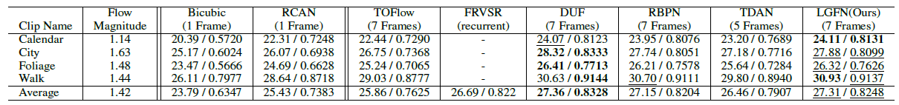

# Local-Global Fusion Network for Video Super-Resolution

This repository is about Local-Global Fusioin Network for Video Super-Resolution (LGFN).

## Introduction

Our proposed Local-Global Fusion Network for Video Super-Resolution (LGFN) devotes to effectively addressing the problem of restoring low-resolution (LR) videos to high-resolution (HR) ones. Features are extracted from the input frames through a feature extraction module. Then, we align the neighboring frames with the reference frame through stacked deformable convolutions (DCs) with decreased multi-dilation convolution units (DMDCUs) to predict more accurate parameters. After that, features are fused by local fusion module and global fusion module respectively. The outputs are integrated together and sent into the reconstruction module to restore high resolution video frames.

## Dependencies
- Python 3.6
- PyTorch = 1.0.1
- Deformable Convolution -> [https://github.com/chengdazhi/Deformable-Convolution-V2-PyTorch/tree/pytorch_1.0.0](https://github.com/chengdazhi/Deformable-Convolution-V2-PyTorch/tree/pytorch_1.0.0)

## Dataset
- [Vimeo_90k](https://pan.baidu.com/share/init?surl=WdQTorJmzAdRgh8sS7B3bw) (extracted code: "hjle")
- [Vid4](https://pan.baidu.com/share/init?surl=XG94zpYsXX5nh0x1oAfF9g) (extracted code: "htvb")
- [SPMCS](https://pan.baidu.com/share/init?surl=eW5dc0-K8NPmsDen-W71LA) (extracted code: "ouyg")

## Pretrained Model
- [Model](https://drive.google.com/drive/folders/1-zdNUBvLhmOwDor8f1wgTwRIHCE-7xDr?usp=sharing)

## Experimental Results

### Quantitative Results

Quantitative results of state-of-the-art SR algorithms on Vid4 for 4 ×.  **Bold type** indicates the best and <u>underline</u> indicates the second best performance (PSNR/SSIM). 

Quantitative results of state-of-the-art SR algorithms on SPMCS for 4 ×. The results are the average evaluation across all restored video frames.  **Bold type** indicates the best and <u>underline</u> indicates the second best performance (PSNR/SSIM). 

Quantitative results of state-of-the-art SR algorithms on part of SPMCS clips for 4 ×.  **Bold type** indicates the best and <u>underline</u> indicates the second best performance (PSNR/SSIM). 

Quantitative results of state-of-the-art SR algorithms on Vimeo-90K-T for 4 ×.  **Bold type** indicates the best and <u>underline</u> indicates the second best performance (PSNR/SSIM). 

### Visual Results

Visual comparisons on Vid4 for 4 × scaling factor. Zoom in to see better visualization.

Visual comparisons on SPMCS for 4 × scaling factor.

Visual comparisons on Vimeo-90K-T for 4 × scaling factor.

